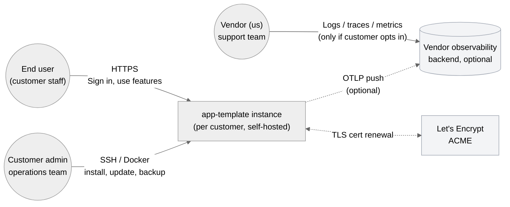
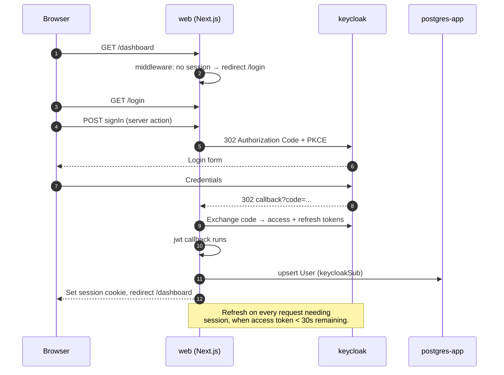
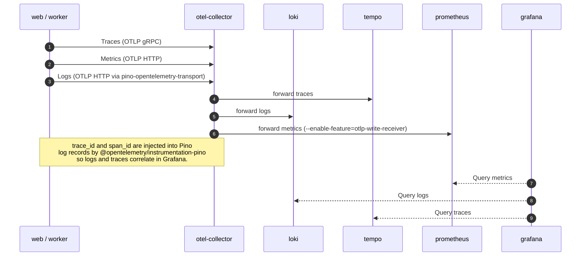

# Architecture

System view of the app template. Diagrams are [C4](https://c4model.com/) Level 1 (system context) and Level 2 (containers). Component-level diagrams cover the parts the template ships — auth flow, job flow, observability flow.

## L1 — System context



**Boundaries.** One **deployment per customer** (single tenant per ADR 0002). Customer hardware hosts everything. We never receive customer data unless they explicitly forward telemetry to our observability backend (`OTEL_EXPORTER_OTLP_ENDPOINT`).

## L2 — Containers (Compose services)

```mermaid
%%{init: {'theme':'neutral'}}%%
flowchart TB
  subgraph edge[net-edge]
    caddy[caddy<br/>reverse proxy + ACME]
  end

  subgraph app[net-app]
    web[web<br/>Next.js 16 standalone]
    worker[worker<br/>Bun + BullMQ + Bull Board]
    keycloak[keycloak<br/>26.x]
  end

  subgraph data[net-data]
    pg_app[(postgres-app)]
    pg_kc[(postgres-keycloak)]
    redis[(redis 7<br/>noeviction)]
    migrator[migrator<br/>one-shot]
  end

  subgraph obs[net-obs (profile: obs)]
    otel[otel-collector]
    loki[(loki)]
    tempo[(tempo)]
    prom[(prometheus)]
    grafana[grafana]
  end

  caddy -- "HTTPS" --- web
  caddy -- "HTTPS" --- keycloak

  web -- "OIDC" --> keycloak
  web -- "Prisma" --> pg_app
  web -- "BullMQ producer" --> redis
  web -- "Reverse-proxy<br/>/admin/queues" --> worker
  web -- "OTLP" --> otel

  worker -- "BullMQ consumer" --> redis
  worker -- "Prisma" --> pg_app
  worker -- "OTLP" --> otel

  keycloak --> pg_kc

  migrator -- "prisma migrate deploy<br/>(once on `up`)" --> pg_app

  otel --> loki
  otel --> tempo
  otel --> prom
  prom --> grafana
  loki --> grafana
  tempo --> grafana

  classDef obs fill:#fff7ed,stroke:#fdba74;
  class otel,loki,tempo,prom,grafana obs;
```

**Networks.** Four Compose networks segregate traffic; only `caddy` exposes host ports.

| Network | Members |
|---|---|
| `net-edge` | caddy, web |
| `net-app` | caddy, web, worker, keycloak |
| `net-data` | web, worker, migrator, postgres-app, postgres-keycloak, redis |
| `net-obs` | web, worker, otel-collector, loki, tempo, prometheus, grafana |

## L3 — Auth flow



## L3 — Job flow

```mermaid
sequenceDiagram
  autonumber
  participant U as Browser
  participant W as web
  participant R as redis (BullMQ)
  participant K as worker
  participant DB as postgres-app

  U->>W: Server action: triggerDemoJob()
  W->>W: rateLimit (Redis sorted set)
  W->>R: enqueueDemoJob (Zod-validated payload)
  R-->>K: BLPOP / consumer event
  K->>K: withSpan('demo.process', ...)
  K->>K: processDemoJob (your code)
  K-->>R: Mark complete (with retention rules)
  Note over W,DB: Optional recordAudit() call from web<br/>writes to audit_log; processor logs via Pino.
```

## L3 — Observability flow



## Source-of-truth boundaries

- **Identity** — Keycloak. Application's `User` table is a mirror keyed by `keycloakSub`
- **Application data** — PostgreSQL (`postgres-app`)
- **Queue state** — Redis (BullMQ); persisted via RDB snapshots in `redis-data`
- **Trace / log / metric data** — Loki / Tempo / Prometheus inside the customer install (or wherever they point `OTEL_EXPORTER_OTLP_ENDPOINT`)
- **Configuration** — Customer's `.env` only; validated via Zod in `@app/config/env`

## Versioning

The template publishes `app-template-web` and `app-template-worker` images to GHCR with SemVer tags + git SHA, linked under the same release version (Changesets). Customer projects fork and re-version per their own SemVer policy. Migrations are forward-only; rollback is "downgrade image + run inverse migration manually" (no auto-rollback).

## See also

- [`docs/operations.md`](operations.md) — runbook for the vendor (us)
- [`docs/customer-install.md`](customer-install.md) — install guide for customer admins
- [`docs/adr/`](adr/) — architecture decision records (decisions with tradeoffs, with full reasoning)
- [`docs/superpowers/specs/2026-05-04-app-template-design.md`](superpowers/specs/2026-05-04-app-template-design.md) — original spec, source of design intent
- [`CLAUDE.md`](../CLAUDE.md) — operational rules per subsystem
